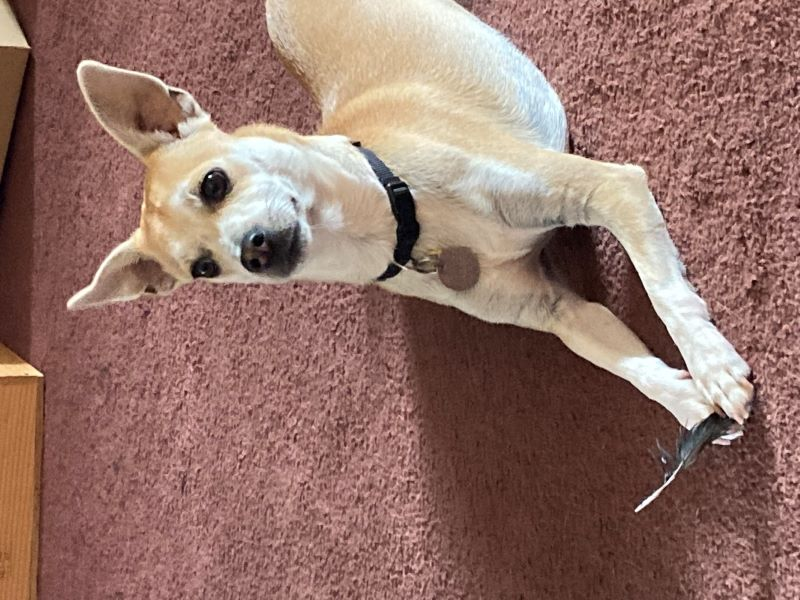

# application

Mock job application for SDEV 328 Frameworks class

This was a quarter long project in which we were tasked to create a job
application website using the m-v-c model and the fat-free-framework. 

We were given very strict design/layout and functionality parameters, but 
total freedom about the fake company. I decided to have fun with it and
make my company all about the dog, using pictures of my own dog where 
pictures were required.
